# Hubyt Cards

Add-on cards for the [Hubyt](https://github.com/bptworld/hubyt) display system.

## Available Cards - 38

### Utility

| Preview | Card | Description |
|---------|------|-------------|
|  | Clock | Time plus local weather |
| 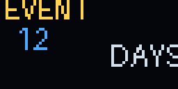 | Countdown | Days until any event |
| 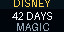 | Disney Countdown | Days until your trip |
| 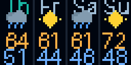 | Weather Forecast | 4-day forecast with icons |
| 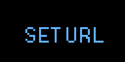 | Google Calendar | Next upcoming event |
| 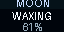 | Moon Phase | Current moon phase |
|  | Countdown Confetti | Event countdown with confetti |

### Finance

| Preview | Card | Description |
|---------|------|-------------|
| 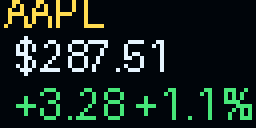 | Stock Ticker | Live price and change |
| 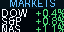 | Market Indexes | Dow, S&P, Nasdaq |
| 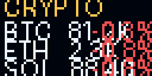 | Crypto Watch | BTC, ETH, and more |
| 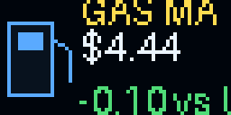 | Gas Price Local | AAA ZIP/metro gas average |
| 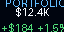 | Portfolio Pulse | Value and daily gain |

### Smart Home

| Preview | Card | Description |
|---------|------|-------------|
|  | Hubitat Device | Live device attribute |
|  | Hubitat Multi | Several Hubitat devices |
|  | Hubitat Safety | All secure or open list |
| 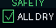 | Water Leak Alert | Skips when all dry |

### Fun

| Preview | Card | Description |
|---------|------|-------------|
| 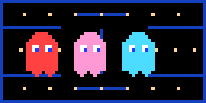 | Pac-Man Chase | Pac-Man chasing ghosts |
| 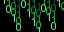 | Matrix Rain | Falling green code |
| 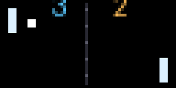 | Pong Loop | Tiny paddles and ball |
|  | Lava Lamp | Drifting pixel blobs |
| 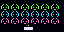 | Alien March | Retro invader parade |
|  | Snake | Snake eats dots |
| 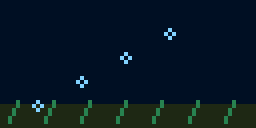 | Pixel Aquarium | Fish and bubbles |
|  | Fireplace | Pixel flames |
| 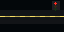 | Tiny Traffic | Cars and signal lights |
| 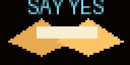 | Fortune Cookie | Tiny daily fortune |
|  | 8-Bit Heartbeat | Pulsing pixel heart |
|  | Pixel Globe | Tiny rotating world |

### Weather

| Preview | Card | Description |
|---------|------|-------------|
|  | Weather Mood | Animated weather vibe |
| 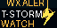 | Weather Alert | Skips when clear |

### Sports

| Preview | Card | Description |
|---------|------|-------------|
| 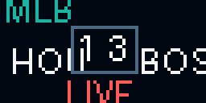 | MLB Scores | Live ESPN scoreboard |
| 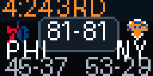 | NBA Scores | Live ESPN scoreboard |
| 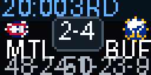 | NHL Scores | Live ESPN scoreboard |
| 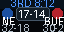 | NFL Scores | Live ESPN scoreboard |

### Travel

| Preview | Card | Description |
|---------|------|-------------|
| 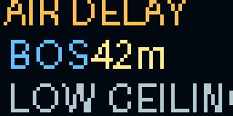 | Airport Delays | FAA delay status |
| 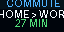 | Commute Time | Drive time estimate |
| 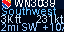 | Flights Overhead | Live flights above you |
| 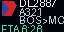 | Flight Tracker | Track a specific flight |

## Installing a Card

Open Hubyt, click **Browse Cards**, and click **Install** next to any card.

## Writing Your Own Card

Each card is a single Python file in `addons/`. It must define:

```python
CARD_ID = "mycard"           # unique slug
CARD_NAME = "My Card"        # display name
CARD_DETAIL = "Short blurb"  # one-line description
CARD_OPTIONS = [             # configurable options (can be empty list)
    {"key": "myOption", "label": "Label", "type": "text", "default": "value", "maxlength": 10}
]

def render(options=None):
    # return WebP image bytes (64x32 pixels)
    ...
```

Import shared utilities from `card_utils`:

```python
from card_utils import draw_sharp_text, render_text_webp, fetch_json_url
```

To submit a card, open a pull request adding your `.py` file to `addons/` and an entry to `registry.json`.
